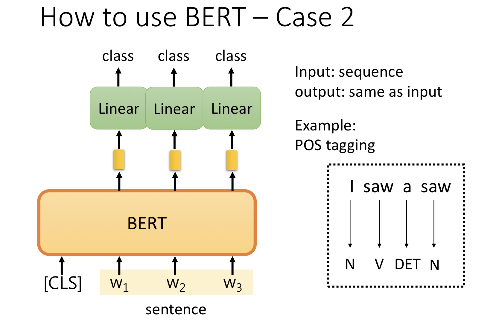
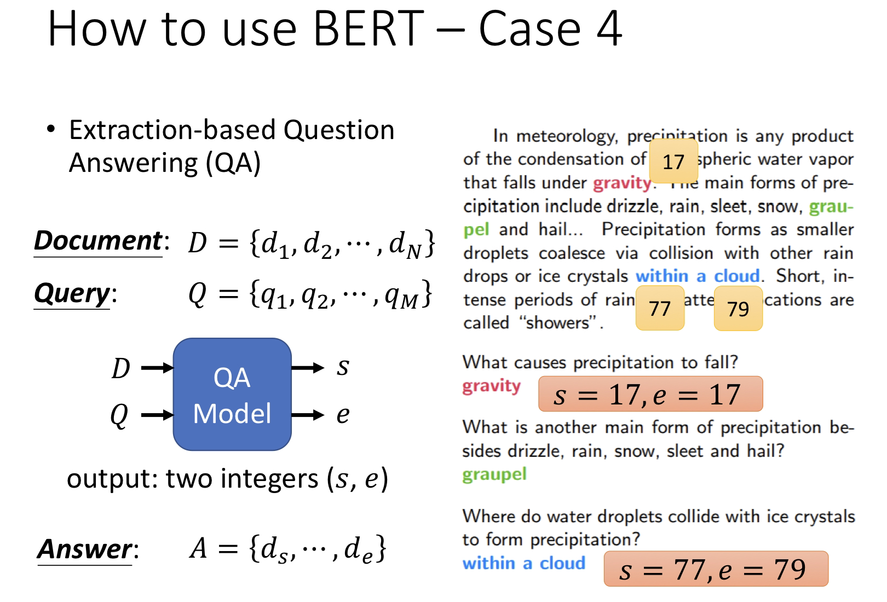

# BERT-Pytorch

## 1. 🛠️模型结构

BERT 全称为 **Bidirectional Encoder Representation from Transformer**，是 Google 以无监督的方式利用大量**无标注**文本「炼成」的语言模型，其架构为 Transformer 中的 Encoder（BERT=Encoder of Transformer）

不同的 NLP 任务通常需要不同的模型，而设计这些模型并测试其 performance 是非常耗成本的（人力，时间，计算资源）。**如果有一个能直接处理各式 NLP 任务的通用架构该有多好？**

随着时代演进，不少人很自然地有了这样子的想法，而 BERT 就是其中一个将此概念付诸实践的例子

Google 在预训练 BERT 时让它同时进行两个任务：


1. 漏字填空（完型填空），原论文为 **Masked Language Model**
2. 判断第 2 个句子在原始本文中是否跟第 1 个句子相接（**Next Sentence Prediction**）

接下来分别详细介绍论文中这两个任务的设计细节

## 2. 🛠️模型任务(预训练)

#### BERT 语言模型任务一：Masked Language Model

在 BERT 中，Masked LM（Masked Language Model）构建了语言模型，简单来说，就是**随机遮盖或替换**一句话里面的任意字或词，然后让模型通过上下文预测那一个被遮盖或替换的部分，之后**做 Loss 的时候也只计算被遮盖部分的 Loss**，这其实是一个很容易理解的任务，实际操作如下：

1. 随机把一句话中 15% 的 token（字或词）替换成以下内容：
   1. 这些 token 有 80% 的几率被替换成 `[MASK]`，例如 my dog is hairy→my dog is [MASK]
   2. 有 10% 的几率被替换成任意一个其它的 token，例如 my dog is hairy→my dog is apple
   3. 有 10% 的几率原封不动，例如 my dog is hairy→my dog is hairy
2. 之后让模型**预测和还原**被遮盖掉或替换掉的部分，计算损失的时候，只计算在第 1 步里被**随机遮盖或替换**的部分，其余部分不做损失，其余部分无论输出什么东西，都无所谓

这样做的好处是，BERT 并不知道 [MASK] 替换的是哪一个词，而且任何一个词都有可能是被替换掉的，比如它看到的 apple 可能是被替换的词。这样强迫模型在编码当前时刻词的时候不能太依赖当前的词，而要考虑它的上下文，甚至根据上下文进行 "纠错"。比如上面的例子中，模型在编码 apple 时，根据上下文 my dog is，应该把 apple 编码成 hairy 的语义而不是 apple 的语义。

#### BERT 语言模型任务二：Next Sentence Prediction

我们首先拿到属于上下文的一对句子，也就是两个句子，之后我们要在这两个句子中加一些特殊的 token：`[CLS]上一句话[SEP]下一句话[SEP]`。也就是在句子开头加一个 `[CLS]`，在两句话之间和句末加 `[SEP]`，具体地如下图所示


可以看到，上图中的两句话明显是连续的。如果现在有这么一句话 `[CLS]我的狗很可爱[SEP]企鹅不擅长飞行[SEP]`，可见这两句话就不是连续的。在实际训练中，我们会让这两种情况出现的数量为 **1:1**

```
Token Embedding` 就是正常的词向量，即 PyTorch 中的 `nn.Embedding()
```

`Segment Embedding` 的作用是用 embedding 的信息让模型分开上下句，我们给上句的 token 全 0，下句的 token 全 1，让模型得以判断上下句的起止位置，例如

```
[CLS]我的狗很可爱[SEP]企鹅不擅长飞行[SEP]
 0   0 0 0 0 0 0 0  1 1 1 1 1 1 1 1
```

`Position Embedding` 和 Transformer 中的不一样，不是三角函数，而是学习出来的

#### Multi-Task Learning

BERT 预训练阶段实际上是将上述两个任务结合起来，同时进行，然后将所有的 Loss 相加，例如

```
Input:
[CLS] calculus is a branch of math [SEP] panda is native to [MASK] central china [SEP]

Targets: false, south
----------------------------------
Input:
[CLS] calculus is a [MASK] of math [SEP] it [MASK] developed by newton and leibniz [SEP]

Targets: true, branch, was
```

## 3. 🛠️Fine-Tuning

BERT 的 Fine-Tuning 共分为 4 中类型，以下内容、图片均来自台大李宏毅老师 [Machine Learning 课程](http://speech.ee.ntu.edu.tw/~tlkagk/courses_ML19.html)

### 3.1 classification(文本分类)


首先在输入句子的开头加一个代表分类的符号 `[CLS]`，然后将该位置的 output，丢给 Linear Classifier，让其 predict 一个 class 即可。整个过程中 Linear Classifier 的参数是需要从头开始学习的，而 BERT 中的参数微调就可以了

**为什么要用第一个位置，即 `[CLS]` 位置的 output。**

因为 BERT 内部是 Transformer，而 Transformer 内部又是 Self-Attention，所以 `[CLS]` 的 output 里面肯定含有整句话的完整信息，这是毋庸置疑的。但是 Self-Attention 向量中，自己和自己的值其实是占大头的，现在假设使用 w1 的 output 做分类，那么这个 output 中实际上会更加看重 w1，而 w1 又是一个有实际意义的字或词，这样难免会影响到最终的结果。但是 `[CLS]` 是没有任何实际意义的，只是一个占位符而已，所以就算 `[CLS]` 的 output 中自己的值占大头也无所谓。当然也可以将所有词的 output 进行 concat，作为最终的 output。

### 3.2 Slot Filling



将句子中各个字对应位置的 output 分别送入不同的 Linear，预测出该字的标签。其实这本质上还是个分类问题，只不过是对每个字都要预测一个类别。

### 3.3 Natural Language Inference(自然语言推理)


即给定一个前提，然后给出一个假设，模型要判断出这个假设是 正确、错误还是不知道。这本质上是一个三分类的问题，和 Case 1 差不多，对 `[CLS]` 的 output 进行预测即可

### 3.4 Question & Answer(问答)



如上图，将一篇文章，和一个问题（这里的例子比较简单，答案一定会出现在文章中）送入模型中，模型会输出两个数 s,e，这两个数表示，这个问题的答案，落在文章的第 s 个词到第 e 个词。具体流程我们可以看下面这幅图


首先将问题和文章通过 `[SEP]` 分隔，送入 BERT 之后，得到上图中黄色的输出。此时我们还要训练两个 vector，即上图中橙色和黄色的向量。首先将橙色和所有的黄色向量进行 dot product，然后通过 softmax，看哪一个输出的值最大，例如上图中 d2 对应的输出概率最大，那我们就认为 s=2


同样地，我们用蓝色的向量和所有黄色向量进行 dot product，最终预测得 d3 的概率最大，因此 e=3。最终，答案就是 s=2,e=3

你可能会觉得这里面有个问题，假设最终的输出 s>e 怎么办，那不就矛盾了吗？其实在某些训练集里，有的问题就是没有答案的，因此此时的预测搞不好是对的，就是没有答案

以上就是 BERT 的详细介绍，参考以下文章

- [進擊的 BERT：NLP 界的巨人之力與遷移學習](https://leemeng.tw/attack_on_bert_transfer_learning_in_nlp.html)
- [李宏毅 - Introduction of ELMO,BERT,GPT](https://www.bilibili.com/video/BV17441137fa)
- [BERT 详解（附带 ELMo、GPT 介绍）](https://wmathor.com/index.php/archives/1456/)
- [BERT: Pre-training of Deep Bidirectional Transformers for Language Understanding](https://arxiv.org/pdf/1810.04805)

## 4. 📑使用说明

## 3.1 克隆项目

```
git clone https://github.com/JiaxingSong718/BERT.git
cd BERT
```

## 3.2 安装依赖

本项目推荐使用`python 3.10`，过老的python版本可能不兼容所依赖的第三方库。

pip安装：

```
pip install -r ./requirements.txt
```

## 3.3 预训练BERT

```
python train.py
```

## 3.4 Fine-Tuning

待更新~
